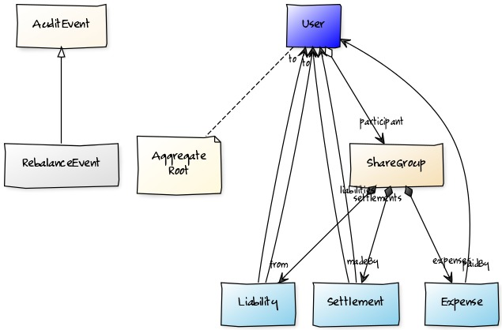

# Shareoo
Cost Sharing App
## Use Cases
 1. As an unregistered user I should be able to Register to the application
 1. As a registered user I should be able to create ShareGroup, when I do, I automatically become a participant to this event
 1. As a participant I should be able to add participants to the ShareGroup
 1. As a participant I should be able to add Expenses to the ShareGroup. 
 1. Expenses Added are equally shared with all participants of the ShareGroup.
 1. As a participant I should be able to view details of all expenses the ShareGroup
 1. As a participant I should be able to view my receivables for the ShareGroup
 1. As a participant I should be able to view my liabilities for the ShareGroup
 1. As a registered user I should be able to view my receivables
 1. As a registered user I should be able to view my liabilities
 1. As a registered user I should be able to settle a set of my liabilities
 1. When a participant settle a liability I should get my share.
 1. As a registered user I should be able to view my past settlements
## Domain Model

Initially considering whole as a single bounded context, though the expense and settlement can still be segregated, does not give benefit as the overall model is quite simple consider the smaller set of UseCases 

## Architecture

Current Implementation will be ommitting the Aggregation Layer. The requirement of initial pilot Phase can be supported without the Additional Caching. 

As more regions are brought under the pilot we should be adding the aggregation and a distributed cache to give optimal performance. 

Also current domain model and usecase quite simple. When more functionalities are added the model will be needed to be broken into multiple smaller Bounded Context and necessitating the need for Aggregation over Context Specific Repos Services.

### Philosophy  
Segregating the Architecture layers into a 4 tier model provides benefits of the 3Tier model. 
This inherently supports distributed environment. 
Further reactivity  makes calls nonblocking and allows to become resilient. Ideally each functionality would be developed using a feature toggle, but by becoming reactive we do not need to have a plethora of conditions to support toggles.
Individual service can turn on and turn off it self based on toggles and stop processing the event. 
Keeping the DataStructure different for Read and Write allows for specialized services and repos and faster retrieval through pre aggregated, cached data (tire omitted from initial Pilot).

## POC
To Execute 
1. Start shareoo-eureka
2. Start Rabbit MQ 
3. Start shareoo-repo (Embedded Mongo)
4. Start shareoo-services (Event Driven)   

### Omissions
1. Security
2. Cloud Config / Testing
3. Resiliency / Testing
4. BDD Covering Events
5. Pipeline Config
6. Gateway layer and caching

 